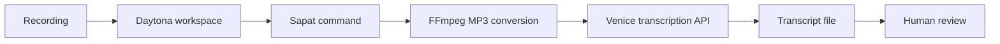

# Run Venice Transcription With Sapat

# Introduction

AI engineers often receive useful knowledge in formats that are not easy to
search: demo recordings, interviews, office hours, product walkthroughs, design
reviews, lectures, and internal training videos. A reliable
[audio transcription](../definitions/20260520_definition_audio_transcription.md)
workflow turns those recordings into text that can be reviewed by humans and
then reused in documentation, retrieval systems, evaluation datasets, or
summaries.

This guide shows how to run a Venice-backed Sapat transcription workflow inside
a Daytona workspace. Sapat already provides a small command-line interface for
turning video files into MP3 audio, sending the audio to a transcription
provider, and writing the transcript beside the source file. The companion Sapat
pull request adds Venice as another provider so teams can use Venice's
multipart transcription endpoint with environment-based credentials and no
committed secrets.

The workflow is designed to be repeatable. Daytona gives the project a clean
development workspace, Sapat handles file conversion and transcript generation,
and Venice supplies speech-to-text models such as Whisper. By keeping the
provider key in `.env`, keeping sample recordings small, and validating the
first transcript before processing a full folder, you get a safer path from raw
recording to reviewable text.

## TL;DR

- Create a Daytona workspace from a small Sapat project.
- Configure the Venice API key and transcription settings through `.env`.
- Run Sapat against one recording first, then a directory when the setup is
  proven.
- Use the Whisper-backed Venice model when you need language hints and broad
  speech-to-text coverage.
- Keep transcripts reviewable with short smoke tests, timestamp settings, and
  a repeatable handoff checklist.

## Prerequisites

To follow this guide, you need:

- Daytona installed and configured. See the
  [Daytona installation guide](https://www.daytona.io/docs/installation/installation/).
- Docker available on your machine.
- A code editor connected to your Daytona workspace.
- A Venice API key with access to the audio transcription API.
- A short audio or video file for validation, ideally under one minute.
- Basic familiarity with [Python](../definitions/20240820_defintion_python.md)
  and [development environments](../definitions/20240819_definition_development environment.md).

This guide uses a Venice provider added in the companion Sapat contribution:
[nibzard/sapat pull request 24](https://github.com/nibzard/sapat/pull/24).
If that pull request has not been merged yet, use the contributor branch shown
below when creating your workspace. After it is merged, you can replace the
branch URL with the upstream Sapat repository.

## How the Workflow Fits Together

Sapat keeps the workflow intentionally small. It accepts a file or directory,
converts media to MP3 with FFmpeg, calls the selected provider through
`--api`, and writes a `.txt` transcript beside the input file. The Venice
provider follows the same pattern as the existing providers: credentials are
read from environment variables, the provider sends a multipart request, and
the returned `text` field becomes the saved transcript.



The important design decision is that Daytona owns the environment and Sapat
owns the transcription task. That keeps the provider key out of the repository,
keeps dependencies isolated from the host machine, and gives every engineer the
same commands when a workflow needs to be repeated later.

## Step 1: Create a Sapat Workspace in Daytona

Start the Daytona server if it is not already running:

```bash
daytona server
```

Create a workspace from the Sapat fork that contains the Venice provider:

```bash
daytona create https://github.com/Da7-Tech/sapat.git
```

Open the workspace in your preferred editor when Daytona finishes provisioning
it. Then switch to the Venice provider branch:

```bash
git checkout add-venice-transcription-provider
```

If you prefer to create the workspace from a Git provider prompt, choose the
same repository and then check out the branch from the workspace terminal.

Once the workspace is open, inspect the project:

```bash
ls
sed -n '1,180p' README.md
sed -n '1,220p' src/sapat/script.py
```

You should see a Python package with a command called `sapat`, transcription
providers under `src/sapat/transcription`, and a README that documents the
provider environment variables.

## Step 2: Install Runtime Dependencies

Install Sapat in editable mode so the command points at the code in the
workspace:

```bash
python -m pip install --upgrade pip
python -m pip install -e .
```

Sapat converts media files to MP3 before transcription, so FFmpeg must also be
available inside the workspace. Check first:

```bash
ffmpeg -version
```

If FFmpeg is missing from your workspace image, install it with your base
image's package manager. For a Debian or Ubuntu based workspace, use:

```bash
sudo apt-get update
sudo apt-get install -y ffmpeg
```

Confirm the Sapat command is available:

```bash
sapat --help
```

The help output should include `--api` as a required option and `venice` as one
of the supported provider choices.

## Step 3: Configure Venice Without Committing Secrets

Create a local `.env` file in the Sapat workspace:

```bash
cp .env.example .env 2>/dev/null || touch .env
```

Add the Venice settings:

```bash
VENICE_API_KEY=replace_with_your_key
VENICE_MODEL=openai/whisper-large-v3
VENICE_API_ENDPOINT=https://api.venice.ai/api/v1/audio/transcriptions
VENICE_TIMESTAMPS=false
```

Do not commit `.env`. Keep it local to the Daytona workspace and rotate the key
if it is ever shared by mistake.

The Venice transcription endpoint accepts multipart form data with a file,
model, response format, and timestamp option. The official Venice documentation
lists `openai/whisper-large-v3` as one of the available transcription models,
alongside other speech-to-text models, and notes that `language` can be provided
as an ISO 639-1 hint for models that support it.

Whisper is a strong default for multilingual recordings because it is widely
used for speech-to-text and can accept language hints such as `en`, `es`, or
`fr`. If you know the language of the recording, passing the hint helps remove
one source of ambiguity. If you do not know it, omit the language flag and let
the provider detect it.

## Step 4: Run a One-File Smoke Test

Before transcribing a full folder, put one short recording in a `samples`
directory:

```bash
mkdir -p samples transcripts
```

Copy a short `.mp3`, `.mp4`, `.m4a`, `.wav`, or `.webm` file into `samples`.
Then run Sapat with Venice:

```bash
sapat samples/demo.mp4 --quality H --language en --api venice
```

Sapat will:

- Convert the input recording to an MP3 file if needed.
- Send the MP3 to the Venice transcription endpoint.
- Write a transcript as `samples/demo.txt`.
- Remove the temporary MP3 file after the transcript is saved.

Open the transcript and check the first pass:

```bash
sed -n '1,120p' samples/demo.txt
```

Look for three things:

- The transcript should contain the expected topic and speaker vocabulary.
- Product names, acronyms, and code terms should be recognizable.
- The output should be long enough to match the recording rather than ending
  after the first sentence.

If the transcript is empty or obviously mismatched, fix the provider
configuration before running any batch job.

## Step 5: Tune Model, Language, and Timestamp Settings

Venice exposes several models for transcription. Keep the model in `.env` so
engineers can change it without editing code:

```bash
VENICE_MODEL=openai/whisper-large-v3
```

Use `--language` when you know the source language:

```bash
sapat samples/spanish-demo.mp4 --quality H --language es --api venice
```

Set timestamps to true when you need a time-aligned review pass:

```bash
VENICE_TIMESTAMPS=true
```

Timestamped responses are useful when reviewers need to jump back to the
recording and verify a confusing phrase. For plain documentation drafts,
timestamps can stay disabled so the transcript is simpler to read.

The `--quality` flag controls MP3 conversion before the provider call:

- `L` is useful for quick smoke tests.
- `M` is a balanced default for ordinary recordings.
- `H` keeps more audio detail for important or noisy recordings.

Use `H` for the first serious validation. After you know how the provider
handles your audio, you can decide whether a lower quality setting is acceptable
for larger batches.

## Step 6: Process a Directory of Recordings

After the one-file smoke test succeeds, place the rest of the recordings in one
folder:

```bash
mkdir -p recordings
```

Run Sapat against the directory:

```bash
sapat recordings --quality H --language en --api venice
```

Each input file receives a matching `.txt` file. Keep the raw recordings and
generated transcripts together until review is complete:

```bash
find recordings -maxdepth 1 -type f | sort
```

For team workflows, commit a small manifest but not the recordings themselves:

```bash
cat > transcript-run.md <<'EOF'
# Transcript Run

- Provider: Venice
- Model: openai/whisper-large-v3
- Language hint: en
- Quality: H
- Timestamps: false
- Reviewer:
- Notes:
EOF
```

The manifest gives reviewers enough context to reproduce the run without
exposing the API key or requiring the original operator to remember the exact
settings.

## Step 7: Review and Handoff the Transcript

Do not treat a raw transcript as a final artifact. Use a short review pass:

```bash
grep -n "TODO\\|unknown\\|inaudible" recordings/*.txt
```

Then scan for terms that are easy for speech-to-text systems to miss:

- Product names.
- Speaker names.
- Repository names.
- Acronyms.
- Version numbers.
- Command-line flags.
- Error messages.

For technical recordings, add a small glossary next to the transcript:

```bash
cat > recordings/glossary.md <<'EOF'
# Glossary

- Daytona
- Sapat
- Venice
- Whisper
- FFmpeg
EOF
```

Use the glossary during review and keep corrections visible. A transcript that
will feed a retrieval or summarization system should preserve technical terms
more carefully than a transcript used only for casual notes.

## Common Issues and Troubleshooting

**Problem:** `VENICE_API_KEY must be set to use the Venice API.`

**Solution:** Check that `.env` exists in the Sapat working directory and that
`VENICE_API_KEY` is not blank. Restart the shell or rerun the command after
editing `.env`.

**Problem:** The API returns an unsupported file type error.

**Solution:** Use a supported audio or video format such as MP3, MP4, WAV, M4A,
FLAC, OGG, or WEBM. If the source format is unusual, convert it with FFmpeg
before running Sapat.

**Problem:** The transcript is in the wrong language.

**Solution:** Add the `--language` hint when using a model that supports it.
For example, use `--language en` for English or `--language es` for Spanish.

**Problem:** The transcript misses product names or code terms.

**Solution:** Run a shorter test clip first, keep a glossary beside the
recording, and review the transcript before using it in documentation or
retrieval workflows.

**Problem:** FFmpeg is not found.

**Solution:** Install FFmpeg inside the Daytona workspace. For Debian or Ubuntu
based images, run `sudo apt-get update` and then `sudo apt-get install -y
ffmpeg`.

## Conclusion

Sapat gives AI engineers a direct way to turn recordings into transcripts, and
Daytona makes that workflow reproducible across machines. Adding Venice as a
provider gives teams another speech-to-text option while preserving the same
Sapat command-line flow: configure credentials in `.env`, run a short smoke
test, process the target files, and review the generated text before handoff.

The most important habit is to validate the workflow with one short recording
before processing a folder. That single step catches missing keys, unsupported
formats, language issues, and model configuration mistakes while the cost and
time impact are still small.

## References

- [Sapat repository](https://github.com/nibzard/sapat)
- [Companion Venice provider pull request](https://github.com/nibzard/sapat/pull/24)
- [Venice Transcriptions API documentation](https://docs.venice.ai/api-reference/endpoint/audio/transcriptions)
- [Daytona installation documentation](https://www.daytona.io/docs/installation/installation/)
